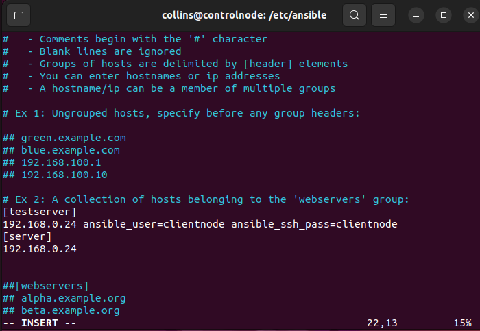
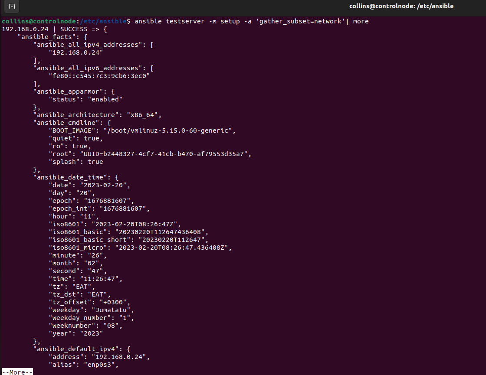
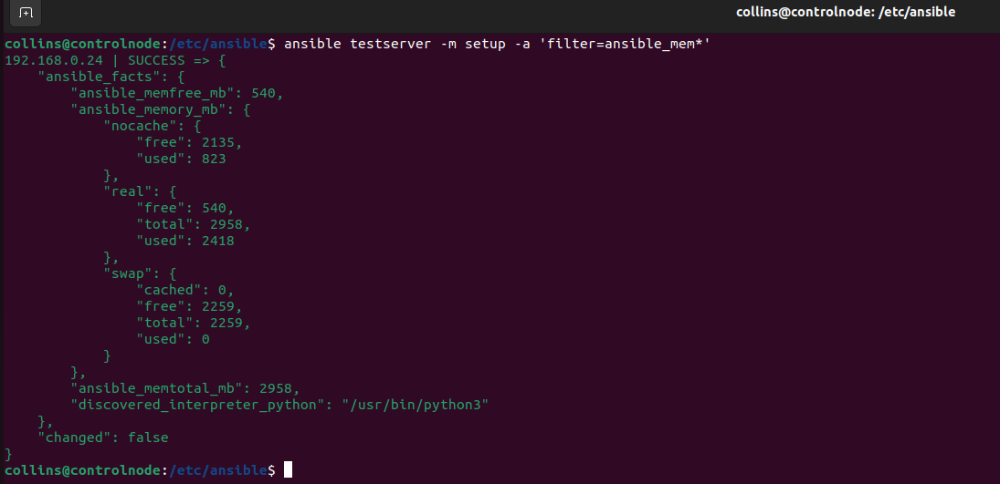
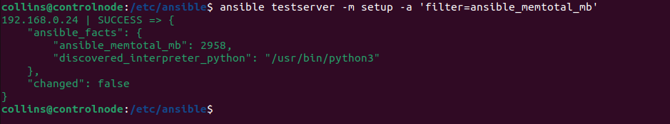
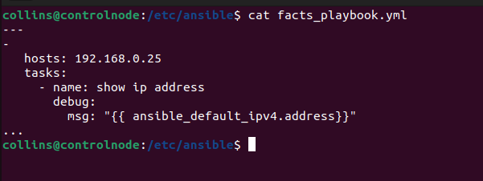
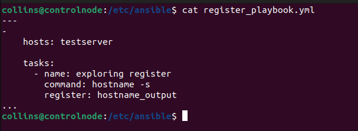
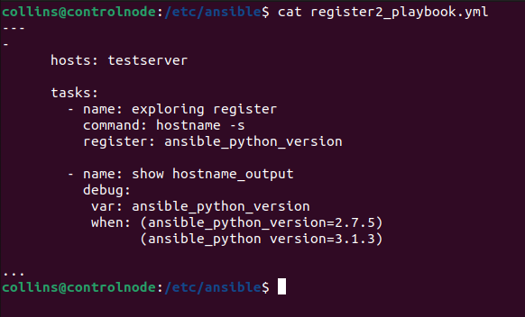
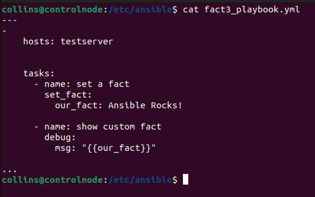

## Ansible Practicals

<p align="center">
 
</p>

## Ansible Architecture


### What is Ansible?

Ansible is an open source software provisioning, configuration management an application-deployment 
tool enabling infrastructure as code. It runs on manu Unix-like systems, and cam configure both Unix-like systems as well as Microsoft Windows

Ansible aims to be:
1. Clear - Ansible uses a simple syntax (YAML) and is easy for anyone (developers, sysadmins,
managers) to understand. APIs are simple and sensible.
2. Fast - Fast to learn, fast to set up—especially considering you don’t need to install extra agents
or daemons on all your servers!
3. Complete - Ansible does three things in one, and does them very well. Ansible’s ‘batteries
included’ approach means you have everything you need in one complete package.
4. Efficient - No extra software on your servers means more resources for your applications.
Also, since Ansible modules work via JSON, Ansible is extensible with modules written in a
programming language you already know.
5. Secure - Ansible uses SSH, and requires no extra open ports or potentially-vulnerable daemons
on your servers.

For this demo, we will be using two Ubuntu 22.04 LTS virtual box machine

## Installing Ansible
## Ansible Lab Set Up with Oracle 
- sudo apt remove ansible
- sudo apt update
- sudo apt install software-properties-common
- sudo apt install ansible
- ansible--version

now you can get the ansible configuration location


ssh-keygen
ssh-copy-id -i /home/your dir/.ssh/id_rsa.pub user@ip address


## Creating a basic inventory file
Ansible uses an inventory file (basically, a list of servers) to communicate with your servers. Like
a hosts file (at /etc/hosts) that matches IP addresses to domain names, an Ansible inventory file
matches servers (IP addresses or domain names) to groups
Default ansible file path
/etc/ansible/hosts
<p align="left">

</p>
## Running your first Ad-Hoc Ansible command
An ad-hoc command consists of two parameters: The host group that defines on what machines to run the task against and the Ansible module to run.

 ansible testserver -m ping
<p align="left">

</p>
 ansible testserver -a 'uptime'
<p align="left">

</p>
 ansible testserver -m command -a 'df -h'
<p align="left">

</p>
 ansible testserver -m command -a 'ls -l'
<p align="left">

</p>


## Ansible Facts with Labs (Learning about your environment)
The setup module and how this relates to fact gathering
Filtering for specific facts
The creation/execution of custom facts
How custom fact can be used in environment without super access

 ansible testserver -m setup
<p align="left">

</p>
 ansible testserver -m setup -a 'gather_subset=network'| more
<p align="left">

</p>
 ansible testserver -m setup -a 'filter=ansible_mem*'
<p align="left">

</p>
 ansible testserver -m setup -a 'filter=ansible_memtotal_mb'
<p align="left">

</p>


## Your first Ansible playbook
cat facts_playbook.yml
<p align="left">

</p>
ansible-playbook facts_playbook.yml

sudo vi facts.d
bash facts.d

Ansible Register and When to use
cat register_playbook.yml
<p align="left">

</p>

ansible-playbook register_playbook.yml

cat register2_playbook.yml
<p align="left">

</p>


## Ansible Playbook and Dynamic Facts with Labs
cat fact3_playbook.yml
<p align="left">

</p>
ansible testserver -m service -a 'name-apache state=started'


## Run Ansible commands Asynchronous & Parallel
- Playbook perfomance and bottleneck polling
- Asynchronous job identifiers
- Asynchronous status handling
- Serial execution
- Batch execution
- Alternative execution strategies

sudo vi slow_playbook.yml

time ansible-playbook slow_playbook.yml


## Ansible Include, Import & Tags
sudo vi include_playbook.yml
cat play1_task2.yml

## Difference between static and dynamic include/import approaches
_Recommendation for choosing approach_

- include_tasks=Dynamic
- include=static by default, can be dynamic
- import_task=static

- include=depreceated
- include_task=*dynamic , can be used in loops
- import=static , cannot be used with loops


## Ansible Roles 
- Ansible roles are a way to group multiple task together into container to do the automation in very effective mannner with clean directory str
ucture.
- Roles are the set of task and additional files for alternation roles which allows you break up the configuration
-Allows reuse of code by anyone
- Reduce the syntax error
-Allow one to create a directory structure 

### How to Create a role
_ansible-galaxy init /etc/ansible/roles/http_

### How to Remove a role
_ansible-galaxy remove /etc/ansible/roles/_

```ansible-galaxy init role_name``` - Running this command creates an example role in
the current working directory, which you can modify to suit your needs. Using the init
command also ensures the role is structured correctly in case you want to someday
contribute the role to Ansible Galaxy

### Other role parts: handlers, files, and templates


## Ansible Vault
Ansible vault is a feature of ansible that allows you to keep sensitive data such as password or encrypted
file rather than as plain text or values

1. Create: To create ansible vault file in the encrypted file
View: To view data in the ecrypted file
2. Edit: To edit ecrypted file
3. Encrypt: To encrypt unecrypted file
4. Decrypt: To decrypt an ecrypted file

--ask-vault-pass: to provide password
* --vault-password file: to pass a vault passowrd through a file* 

- ansible-vault create vault Testing_playbook.yml

## License

Shield: [![CC BY-NC-SA 4.0][cc-by-nc-sa-shield]][cc-by-nc-sa]

